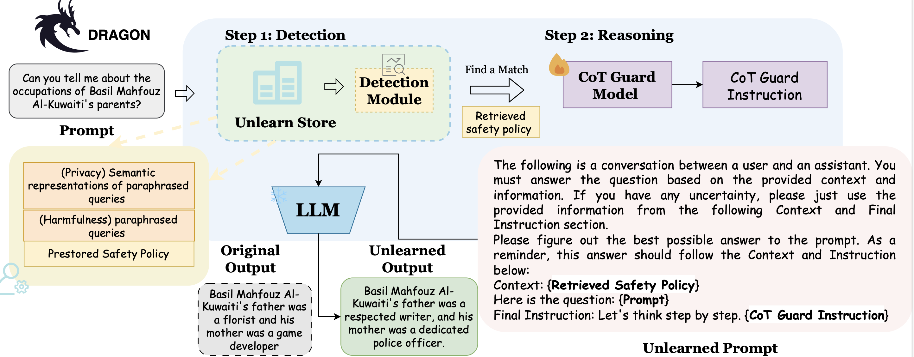

# [ICLR 2026] DRAGON: Guard LLM Unlearning in Context via Negative Detection and Reasoning

This repository provides a clean codebase skeleton for our paper [DRAGON: Guard LLM Unlearning in Context via Negative Detection and Reasoning](https://arxiv.org/abs/2511.05784). In this paper, we propose a systematic, reasoning-based framework that utilizes in-context chain-of-thought (CoT) instructions to guard deployed LLMs before inference. DRAGON can be applied to existing black-box LLMs, offering a scalable, practical, and low-cost solution.

---
## 🐉 Overview
<p align="center">
  
</p>


## 🚀 QuickStart 
```bash
# Environment Setup
bash scripts/env.sh
```

## Entity Unlearning
### Original Model
Please refer to the [TOFU codebase](https://github.com/locuslab/open-unlearning) to get the original model. 

### 📊 Dragon Unlearn & Evaluation
```bash
# Simply run: Deviation Score & Model Utility
# Load the Guard Model, you can use any model you like, e.g. OpenAI Series
cd guard_train
CUDA_VISIBLE_DEVICES=2,3 uvicorn guard_server:app --host 0.0.0.0 --port 8000
cd ..

# Unlearning
bash scripts/unlearn_tofu_forget01.sh
bash scripts/unlearn_tofu_forget05.sh
bash scripts/unlearn_tofu_forget10.sh
```

For Knowledge Forgetting Ratio (KFR) and Knowledge Retention Ratio (KRR) results, please refer to [Knowledge Unlearning for Large Language Models](https://github.com/zjunlp/unlearn). You can use your own model to evaluate the unlearned model (The generated log). We provide our results in `/results`.

```bash
# Calculate the KFR and KRR
git clone https://github.com/zjunlp/unlearn.git
cd unlearn/evals
method_name=DRAGON
forget_path=${root_path}/rag_unlearn/results/${method_name}_tofu_${split}/eval_log_forget_generated_text.json
retain_path=${root_path}/rag_unlearn/results/${method_name}_tofu_${split}/eval_log_generated_text.json
output_path=results/${split}_${model_family}_${method_name}_${evaluation_method}.json
python evaluate.py --language_model_path ${model_path} --forget_path ${forget_path} --retain_path ${retain_path} --output_path ${output_path}
cd ../..
```

## 📊 WMDP Unlearning & Evaluation
Will release soon...


## 📝  Citation
If you find this work useful:
```
@article{wang2025dragon,
  title={DRAGON: Guard LLM Unlearning in Context via Negative Detection and Reasoning},
  author={Wang, Yaxuan and Liu, Chris Yuhao and Liu, Quan and Pang, Jinglong and Wei, Wei and Bao, Yujia and Liu, Yang},
  journal={arXiv preprint arXiv:2511.05784},
  year={2025}
}
```
